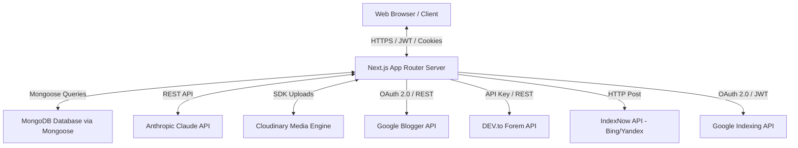
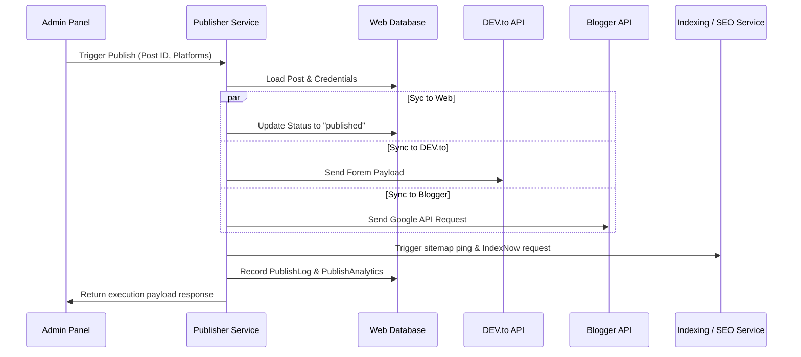
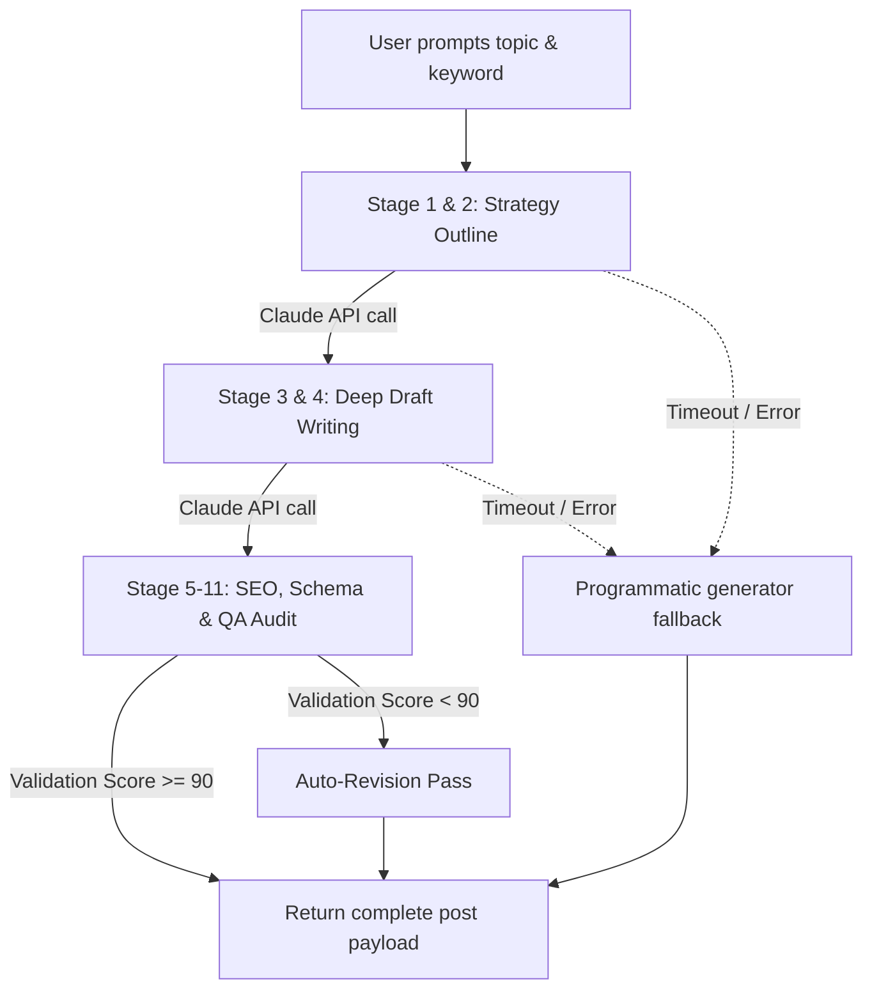

# StreamB4 — Technical Architecture & Documentation
*System Architect Reference & Single Source of Truth*

---

## 1. Project Overview & Mission

**StreamB4** (hosted at [streamb4.com](https://streamb4.com)) is an enterprise-grade IPTV subscription and streaming web portal. The system is designed to provide global users with access to 50,000+ live TV channels, 180,000+ movies/VOD titles, and sports streaming.

From a software engineering perspective, the system acts as a triple-purpose portal:
1. **Public E-Commerce & Knowledge Base**: A high-speed, SEO-optimized front-end website introducing pricing plans, device setup tutorials, download codes, and customer reviews.
2. **AI Studio (Admin Suite)**: A protected, high-efficiency editorial dashboard featuring a multi-stage Content Generation Pipeline powered by the Anthropic Claude API (specifically `claude-3-5-sonnet` and `claude-3-5-haiku` models).
3. **Multi-Platform Publisher Orchestrator**: A scheduling and distribution engine that propagates blog articles to third-party platforms (DEV.to, Google Blogger) while syncing links, sitemaps, RSS feeds, and submitting indexing requests to Google Search Console and Bing (via IndexNow).

---

## 2. System Architecture Blueprint

StreamB4 is built on a modern JavaScript/TypeScript stack utilizing Next.js, React, and MongoDB.



### 2.1 Technology Stack & Frameworks
* **Framework & Core**: [Next.js 16.2.9](file:///c:/Users/clanm/OneDrive/Desktop/ipmigo/iptv-site/package.json#L28) (utilizing App Router and React Server Components) paired with [React 19.2.4](file:///c:/Users/clanm/OneDrive/Desktop/ipmigo/iptv-site/package.json#L30).
* **Database**: MongoDB integrated using [Mongoose 8.24.1](file:///c:/Users/clanm/OneDrive/Desktop/ipmigo/iptv-site/package.json#L27).
* **Styling**: [TailwindCSS v4.0.0](file:///c:/Users/clanm/OneDrive/Desktop/ipmigo/iptv-site/package.json#L48) with PostCSS, using CSS variables for a strict, modern dark-mode aesthetic with amber/orange highlight accents.
* **Animations**: [Framer Motion 12.42.0](file:///c:/Users/clanm/OneDrive/Desktop/ipmigo/iptv-site/package.json#L24) for micro-animations, page transitions, and smooth hover feedback.
* **Analytics & Performance**: Integrated Vercel Analytics and Vercel Speed Insights for real-time user-experience auditing.

### 2.2 Client-Side vs. Server-Side Split
* **React Server Components (RSC)**: Used by default for public routes (`app/page.tsx`, `app/blog/[slug]/page.tsx`, `app/sitemap.ts`) to fetch database contents on the server. This minimizes the initial JavaScript bundle sent to mobile devices, optimizes Largest Contentful Paint (LCP), and boosts SEO crawlers' indexing scores.
* **Dynamic / Client Side Routing**: Specific interactive zones like the pricing selection tabs, contact form submission, search bars, and the entire admin control panel (`app/admin`) are set to `"use client"` and utilize React hooks (`useState`, `useEffect`, `useForm`).
* **Experimental Optimizations**: Set in [next.config.ts](file:///c:/Users/clanm/OneDrive/Desktop/ipmigo/iptv-site/next.config.ts#L106-L114) to automatically optimize imports for large libraries like `framer-motion`, `recharts`, `lucide-react`, and `@uiw/react-md-editor`.

---

## 3. Data Dictionary: Database Models

All models are defined inside [lib/models/](file:///c:/Users/clanm/OneDrive/Desktop/ipmigo/iptv-site/lib/models/) using Mongoose schemas. The application uses a custom-cached DB connection script in [lib/mongodb.ts](file:///c:/Users/clanm/OneDrive/Desktop/ipmigo/iptv-site/lib/mongodb.ts) to prevent serverless function executions from creating duplicate connection threads during high traffic spikes.

### 3.1 Post Schema ([lib/models/Post.ts](file:///c:/Users/clanm/OneDrive/Desktop/ipmigo/iptv-site/lib/models/Post.ts))
This represents the primary collection for blog articles, hosting full SEO analysis scores, AI Studio prompts, and platform syndication logs.

| Field Name | Type | Default Value | Description |
| :--- | :--- | :--- | :--- |
| `id` | String | *Required, Unique* | Unique internal UUID for the article. |
| `slug` | String | *Required, Unique* | URL-friendly slug, indexed for rapid lookups. |
| `title` | String | *Required* | Main H1 article title. |
| `content` | String | `""` | Complete article content written in Markdown. |
| `excerpt` | String | `""` | 150-character summary used for RSS and meta tags. |
| `seoTitle` | String | `""` | Target title optimized for search engine result pages. |
| `metaDescription`| String | `""` | Meta description under 160 characters. |
| `focusKeyword` | String | `""` | The primary keyword targeted for SEO scores. |
| `secondaryKeywords`| Array (String)| `[]` | Supporting semantic keyword checklist. |
| `lsiKeywords` | Array (String)| `[]` | Latent Semantic Indexing terms used in QA checks. |
| `featuredImage` | String | `""` | Cloudinary or external image URL. |
| `ogTitle` | String | `""` | OpenGraph Title for Facebook/LinkedIn. |
| `ogDescription` | String | `""` | OpenGraph Description. |
| `faqs` | Mixed | `[]` | FAQ array representing schema QA pairs. |
| `internalLinks` | Mixed | `[]` | Recommended internal paths and link mappings. |
| `schemaMarkup` | Mixed | `{}` | Complete JSON-LD schema generated for the post. |
| `category` | String | `"General"` | Categorization key (e.g., Device Setup, Sports). |
| `tags` | Array (String)| `[]` | Taxonomy descriptors. |
| `author` | String | `"STREAMB4 Editorial Team"` | Custom author signature. |
| `seoScore` | Number | `0` | Automated algorithmic SEO analysis score (0-100). |
| `readabilityScore`| Number | `0` | Calculated readability score (0-100). |
| `keywordDensity` | String | `""` | Primary keyword density ratio. |
| `readingTime` | Number | `0` | Computed average reading time in minutes. |
| `status` | String | `"draft"` | Publication status (`draft`, `published`, `scheduled`). |
| `views` / `likes` | Number | `0` / `0` | Interactive counters. |
| `publishedAt` | String | `""` | ISO timestamp of final release. |
| `scheduledAt` | String | `""` | ISO timestamp for delayed scheduler releases. |
| `devtoId` | Number | `0` | syndication ID on DEV.to. |
| `devtoUrl` | String | `""` | Direct URL to syndicated DEV.to article. |
| `devtoStatus` | String | `""` | Syndication state (`published`, `failed`, `pending`). |
| `bloggerPostId` | String | `""` | Google Blogger reference ID. |
| `bloggerUrl` | String | `""` | Live Blogger post URL. |
| `bloggerStatus` | String | `""` | Syndication state on Blogger. |
| `outline` | String | `""` | Outlining structure planned by AI Studio. |

### 3.2 Comment Schema ([lib/models/Comment.ts](file:///c:/Users/clanm/OneDrive/Desktop/ipmigo/iptv-site/lib/models/Comment.ts))
Handles comments submitted by site visitors.

* **Fields**:
  * `id` (String): Unique identifier.
  * `postSlug` (String, Indexed): Links the comment directly to a specific article.
  * `postTitle` (String): Title reference.
  * `author` (String): Display name of commenter.
  * `email` (String): Email address of commenter.
  * `content` (String): Plaintext message body.
  * `status` (String, Default: `"pending"`): Moderate filter (`pending`, `approved`, `spam`).
  * `likes` (Number): Upvote counts.
  * `avatar` (String): Gravatar or dynamic character initials path.
  * `createdAt` (String).

### 3.3 Player Schema ([lib/models/Player.ts](file:///c:/Users/clanm/OneDrive/Desktop/ipmigo/iptv-site/lib/models/Player.ts))
Represents the compatible media players indexed for the Installation guides.

* **Fields**:
  * `id` (String): UUID.
  * `name` (String): Player title (e.g., TiviMate Premium).
  * `description` (String): Platform feature notes.
  * `features` (Array of Strings): Key perks.
  * `platforms` (Array of Strings): OS support (Android TV, FireOS, iOS).
  * `downloadUrl` / `apkUrl` (String): Source file targets.
  * `downloaderCode` (String): Shortcode for Amazon Downloader applications.
  * `logo` / `screenshots` (String / Array): Visual media URLs.
  * `recommended` / `enabled` (Boolean): UI tags.
  * `order` (Number): Custom sort index on the installation directory.

### 3.4 Multi-Platform Syndication Schemas
* **`PlatformCredential`** ([lib/models/PlatformCredential.ts](file:///c:/Users/clanm/OneDrive/Desktop/ipmigo/iptv-site/lib/models/PlatformCredential.ts)): Stores API tokens (e.g. `devtoApiKey`) and Google Blogger OAuth tokens (`bloggerAccessToken`, `bloggerRefreshToken`, `bloggerTokenExpiresAt`). Kept encrypted/private on the server-side.
* **`PublishRecord`** ([lib/models/PublishRecord.ts](file:///c:/Users/clanm/OneDrive/Desktop/ipmigo/iptv-site/lib/models/PublishRecord.ts)): Keeps track of the current status of an article on a specific platform. Uses a unique compound index: `{ postId: 1, platform: 1 }`.
* **`PublishLog`** ([lib/models/PublishLog.ts](file:///c:/Users/clanm/OneDrive/Desktop/ipmigo/iptv-site/lib/models/PublishLog.ts)): A granular audit trail tracking every single API request, wall-clock duration (ms), HTTP response statuses, and raw error reports.
* **`PublishAnalytics`** ([lib/models/PublishAnalytics.ts](file:///c:/Users/clanm/OneDrive/Desktop/ipmigo/iptv-site/lib/models/PublishAnalytics.ts)): Accumulates historical logs into 10-digit daily date buckets (`YYYY-MM-DD`) for telemetry tracking on admin dashboards.

---

## 4. Core Services & Orchestration

The backend architecture uses a modular service pattern located in [services/](file:///c:/Users/clanm/OneDrive/Desktop/ipmigo/iptv-site/services/).



### 4.1 Publisher Orchestration ([services/publisher.ts](file:///c:/Users/clanm/OneDrive/Desktop/ipmigo/iptv-site/services/publisher.ts))
This service acts as the central coordinator. 
* **Concurrency model**: Uses `Promise.allSettled` to launch publishing queries in parallel. If syndication on DEV.to fails or times out, the local update and Google Blogger publishing will proceed uninterrupted.
* **Execution Flow**:
  1. Retrieves the primary `Post` database model and platform credentials.
  2. Resolves syndication state. If a remote platform ID exists (`devtoId` or `bloggerPostId`), the service runs a PUT/update request; otherwise, it triggers a POST/creation request.
  3. Translates post markdown content to valid HTML tags for Google Blogger via a custom compiler.
  4. Stores the outputs, updates the daily analytics counters, and generates audit logs.

### 4.2 SEO Assessment Engine ([services/seo.ts](file:///c:/Users/clanm/OneDrive/Desktop/ipmigo/iptv-site/services/seo.ts))
Exposes pure utility functions to run automated audits on drafts. 
* **Key Audits**:
  * **Reading Time**: Math estimator calculated using standard `Math.max(1, Math.ceil(wordCount / 238))` formulas.
  * **Keyword Density**: Normalizes content to lowercase, strips markdown syntax characters, and tracks exact primary/secondary keyword match frequencies.
  * **Alt Tag Compliance**: Inspects markdown image tokens `` and returns counts of images containing blank metadata tags.
  * **Link Checker**: Extracts counts of internal links pointing to `streamb4.com` versus external references.

### 4.3 Search Engine Indexing Service ([services/indexing.ts](file:///c:/Users/clanm/OneDrive/Desktop/ipmigo/iptv-site/services/indexing.ts))
A dynamic dispatcher designed to tell search engine crawl bots to index content immediately.
* **IndexNow integration**: Sends a JSON POST payload containing the hostname (`streamb4.com`), the unique security verification key (`INDEXNOW_KEY`), and target URLs list to `https://api.indexnow.org/indexnow` (alerting Bing, Seznam, and Yandex).
* **Google Indexing API**: Authenticates using Google API client configurations to post URL updates directly to Google's indexing endpoints.

---

## 5. AI Studio & Content Generation Pipeline

The flagship feature of the Admin dashboard is the multi-stage content generator built in [app/api/admin/ai-generate/route.ts](file:///c:/Users/clanm/OneDrive/Desktop/ipmigo/iptv-site/app/api/admin/ai-generate/route.ts). 



### 5.1 The Multi-Stage Execution Model
To bypass the maximum token limits and generation timeouts typical of single-prompt AI generators, the pipeline splits article generation into separate, isolated API calls:

1. **Stage 1 & 2: Strategy Outline**
   * **System Role**: Content Strategist and SEO Researcher.
   * **Task**: Analyzes target country, search intents, semantic keywords, and reads up to 20 existing blog posts to propose contextual internal linking anchors.
   * **Output**: A strategic outline structure with heading allocations, table designs, and word counts.
2. **Stage 3 & 4: Draft & Polish**
   * **System Role**: Technical Writer and Human Editor.
   * **Task**: Generates a natural first draft. Then, executes a complete editor pass to prune AI cliches (like *"In summary"*, *"It is important to remember"*), improve sentence variety, format callouts, and write comparison tables.
3. **Stage 5 to 11: SEO, Schema & Quality Assurance**
   * **System Role**: Technical SEO Specialist and QA Director.
   * **Task**: Creates the metadata assets (meta titles, OG parameters, slug). Generates JSON-LD schema objects (Article, FAQ, Breadcrumbs). Evaluates the drafted copy on standard audit rules. If any scoring category fails to hit a strict threshold of **90/100**, the agent runs a self-correction cycle to revise the text.

### 5.2 Claude Model Hierarchy & Integration Settings
To minimize API bills, haiku is used for structure-focused, low-context operations, while sonnet handles premium, long-form content generation:
* **Primary Models**: `claude-3-5-sonnet-20241022` (Stage 3 & 4), `claude-3-5-haiku-20241022` (Stage 1, 2, 5-11, and independent SEO outlines).
* **API Timeout Guard**: A strict [25-second API execution timer](file:///c:/Users/clanm/OneDrive/Desktop/ipmigo/iptv-site/app/api/admin/ai-generate/route.ts#L1236) is applied to all calls. If the Anthropic API is overloaded, the system aborts the request and falls back to a deterministic, local markdown generator to ensure the server never hangs.

---

## 6. API Specifications

### 6.1 Public API Endpoints

* **`GET /api/players`** ([file](file:///c:/Users/clanm/OneDrive/Desktop/ipmigo/iptv-site/app/api/players/route.ts))
  * **Description**: Returns listings of active IPTV players.
  * **Response**: `200 OK` with `IPlayer[]` array.
* **`POST /api/comments`** ([file](file:///c:/Users/clanm/OneDrive/Desktop/ipmigo/iptv-site/app/api/comments/route.ts))
  * **Description**: Submits an article comment. 
  * **Payload**: `{ postSlug: string, author: string, email: string, content: string }`
  * **Behavior**: Saves with state `"pending"` for admin moderation.
* **`POST /api/newsletter`** ([file](file:///c:/Users/clanm/OneDrive/Desktop/ipmigo/iptv-site/app/api/newsletter/route.ts))
  * **Description**: Adds user email addresses to the subscription newsletter.
  * **Protection**: Subject to strict rate limits (max 3 submissions per hour per IP).
* **`GET /api/rss`** ([file](file:///c:/Users/clanm/OneDrive/Desktop/ipmigo/iptv-site/app/api/rss/route.ts))
  * **Description**: Generates dynamic XML RSS feed containing the latest 20 published posts.

### 6.2 Admin API Endpoints (`/api/admin/*`)
All admin endpoints require valid administrator credentials via cookies, except for media fetch GET routes.

* **`POST /api/admin/auth/login`** ([file](file:///c:/Users/clanm/OneDrive/Desktop/ipmigo/iptv-site/app/api/admin/auth/login/route.ts))
  * **Description**: Validates admin email/password against credentials stored in env.
  * **Response**: Sets the `admin_token` JWT cookie.
* **`POST /api/admin/ai-generate`** ([file](file:///c:/Users/clanm/OneDrive/Desktop/ipmigo/iptv-site/app/api/admin/ai-generate/route.ts))
  * **Description**: Triggers the content generation pipeline.
* **`POST /api/admin/ai-actions`** ([file](file:///c:/Users/clanm/OneDrive/Desktop/ipmigo/iptv-site/app/api/admin/ai-actions/route.ts))
  * **Description**: Performs on-demand transformations on text blocks (translating, humanizing, expanding).
* **`POST /api/admin/publish`** ([file](file:///c:/Users/clanm/OneDrive/Desktop/ipmigo/iptv-site/app/api/admin/publish/route.ts))
  * **Description**: Syncs an article to DEV.to and/or Google Blogger.
* **`POST /api/admin/media/upload`** ([file](file:///c:/Users/clanm/OneDrive/Desktop/ipmigo/iptv-site/app/api/admin/media/route.ts))
  * **Description**: Receives image payloads and uploads them directly to Cloudinary.

---

## 7. Security, Middlewares & Routing Policies

StreamB4 secures the application using a middleware-alternative proxy file, [proxy.ts](file:///c:/Users/clanm/OneDrive/Desktop/ipmigo/iptv-site/proxy.ts), in order to guarantee clean header resolution and state containment across Edge routing platforms.

### 7.1 Route Protection & JWT Verification
* **Admin Access Blocks**: The proxy pattern intercepts all paths starting with `/admin` (except `/admin/login`) and `/api/admin` (except authentication endpoints and media GET queries).
* **Token Checks**: It reads the `admin_token` cookie. The payload is verified cryptographically using the `jose` library's [jwtVerify function](file:///c:/Users/clanm/OneDrive/Desktop/ipmigo/iptv-site/proxy.ts#L41) against the private `JWT_SECRET` key. If token validation fails, users are redirected to `/admin/login` or returned a `401 Unauthorized` response.

### 7.2 IP-Based Rate Limiting
* **General Limit**: The proxy records client IPs via the `x-forwarded-for` header. All API endpoints limit clients to a max of **60 requests per minute**. If exceeded, the client receives a `429 Too Many Requests` response.
* **Newsletter Endpoint Limit**: Specifically rate-limited to **3 requests per hour** per IP to protect SMTP servers from subscription spam attacks.
* **Memory Pruning**: To prevent memory leaks, a cleanup utility runs every 5 minutes to prune expired rate-limiting keys.

### 7.3 Cache & Security Headers
Configured in [next.config.ts](file:///c:/Users/clanm/OneDrive/Desktop/ipmigo/iptv-site/next.config.ts#L34):
* **`X-Frame-Options: SAMEORIGIN`**: Prevents clickjacking attacks.
* **`X-Content-Type-Options: nosniff`**: Prevents MIME-sniffing exploits.
* **`Strict-Transport-Security`**: Enforces HTTPS for 1 year (`max-age=31536000; includeSubDomains`).
* **Cache-Control Policies**: Static image and font files are served with persistent cache parameters (`public, max-age=31536000, immutable`). API routes like RSS are cached for 1 hour with stale-while-revalidate fallback targets.

---

## 8. DevOps & Environment Configuration

### 8.1 Environmental Variables Definition (`.env.local`)
The system requires the following environment configurations to launch in production:

```bash
# Core Security Configuration
JWT_SECRET=              # Cryptographic key for admin tokens
ADMIN_EMAIL=             # Login email for admin access
ADMIN_PASSWORD=          # Plaintext password or Bcrypt hash for admin access
MONGODB_URI=             # Connection string pointing to the MongoDB cluster

# Third-Party AI & Integrations
ANTHROPIC_API_KEY=       # Claude API key for AI Studio
NEXT_PUBLIC_TMDB_API_KEY=# API key for fetching dynamic trending lists
CLOUDINARY_CLOUD_NAME=   # Media engine configurations
CLOUDINARY_API_KEY=
CLOUDINARY_API_SECRET=

# SEO & Public Configuration
NEXT_PUBLIC_SITE_URL=    # Root address (e.g., https://streamb4.com)
REVALIDATE_SECRET=       # Bypasses cache validation endpoints

# Telemetry tracking IDs
NEXT_PUBLIC_GA4_ID=
NEXT_PUBLIC_META_PIXEL_ID=
NEXT_PUBLIC_CLARITY_ID=

# SMTP Email configurations
SMTP_HOST=
SMTP_PORT=
SMTP_USER=
SMTP_PASS=
```

### 8.2 Production Hosting Rules & Edge Buffers
* **Serverless Execution limits**: Configured in [vercel.json](file:///c:/Users/clanm/OneDrive/Desktop/ipmigo/iptv-site/vercel.json#L7-L13). The `/api/admin/ai-generate` route overrides Vercel's default limits with `maxDuration: 60` to ensure serverless instances stay alive while Claude generates large articles.
* **On-Demand Cache Purging**: Dynamic pages rely on Next.js Incremental Static Regeneration (ISR). When authors update posts, the publisher calls `revalidatePath` via the secret endpoint `/api/revalidate` to purge static caches for sitemaps, RSS feeds, and the blog directory immediately.

---

## 9. Development & Migration Guidelines

### 9.1 Data Migrations ([scripts/migrate-to-mongodb.ts](file:///c:/Users/clanm/OneDrive/Desktop/ipmigo/iptv-site/scripts/migrate-to-mongodb.ts))
If database instances are reset, or during initial local setup, developers can run:
```bash
npm run migrate
```
This utility script connects to MongoDB, reads initial datasets from local JSON files (`data/posts.json`, `data/players.json`, `data/users.json`, etc.), converts relative date representations to standard ISO formats, and upserts them into MongoDB using the Mongoose schemas.

### 9.2 Coding Conventions
* **File Extensions**: Use `.tsx` for client-side components containing JSX, and `.ts` for server-side endpoints, helper utilities, and services.
* **Mongoose Models**: Always check `mongoose.models` before compiling schemas (e.g. `mongoose.models.Post || mongoose.model(...)`) to avoid duplicate model compilation errors during Hot Module Reloading (HMR) in Next.js development.
* **Next.js 16 Warnings**: Heed the warnings in `AGENTS.md`. Next.js 16 introduces changes to routing parameters and caching boundaries. Refer to the native build documents before modifying routing layers.
